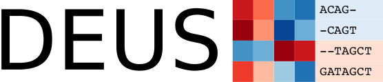

 

# An R package for accurate small RNA profiling based on differential expression of unique sequences 

Tim Jeske, Peter Huypens, Laura Stirm, Selina Hoeckele, Christine Wurmser, Anja Böhm, Cora Weigert, Harald Staiger, Johannes Beckers, and Maximilian Hastreiter

The DEUS R package is a framework for accurate small non-coding RNA (sncRNA) profiling based on differential expression of unique sequences. In comparison to commonly-used 
mapping-based approaches, DEUS generates read counts on the actual sequence reads. Several advantages of this approach include:

- Reads that do not map or map to multiple features are retained in the analysis and represented in an unprecedented and more concise manner
- Sequence clustering provides unique insight into potential processing and editing steps among members of the same cluster
- No need for a reference genome and, therefore, facilitates sncRNA profiling in virtually any organism
- Easy to use and flexible due to high modularity
- Returns intuitively interpretable results

Full documentation is available at  <https://timjeske.github.io/DEUS/>
